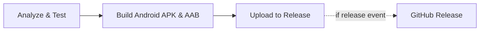
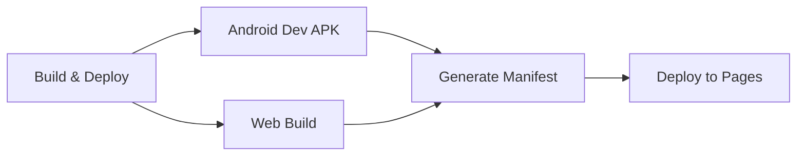

# CI/CD Pipeline Optimization - October 8, 2025

## Issues Resolved

### 1. ❌ Web Build Failure: Non-constant IconData
**Error:**
```
Target web_release_bundle failed: Error: Avoid non-constant invocations of IconData
file:///home/runner/work/ia-helper/ia-helper/lib/screens/library_screen.dart:846:31
```

**Root Cause:**
- `IconData()` constructor called within ternary operator
- Flutter's tree-shaking optimizer requires constant IconData values
- Dynamic icon creation from database string violated this constraint

**Solution:**
```dart
// Before (non-const):
Icon(collection.icon != null ? IconData(int.parse(collection.icon!), ...) : Icons.folder)

// After (const-safe):
IconData collectionIcon = Icons.folder;
if (collection.icon != null) {
  try {
    final codePoint = int.parse(collection.icon!);
    collectionIcon = IconData(codePoint, fontFamily: 'MaterialIcons');
  } catch (e) {
    collectionIcon = Icons.folder;
  }
}
Icon(collectionIcon)
```

**Benefits:**
- ✅ Web builds now succeed
- ✅ Safe error handling for invalid icon data
- ✅ Maintains same functionality
- ✅ Added `--no-tree-shake-icons` as backup

---

### 2. ❌ Duplicate Web Builds (Wasted Time)

**Problem:**
- `flutter-ci.yml` built web → 2 minutes
- `deploy-github-pages.yml` built web → 2 minutes
- **Total waste: 2+ minutes per commit**

**Files Affected:**
```yaml
# flutter-ci.yml had:
- build-web job (REMOVED)
- deploy-web job (REMOVED)

# deploy-github-pages.yml already had web build
```

**Solution:**
- Removed `build-web` and `deploy-web` jobs from `flutter-ci.yml`
- Kept single web build in `deploy-github-pages.yml`
- Added comment explaining separation of concerns

**Before:**
```
flutter-ci.yml: analyze → test → android → web → deploy-web
deploy-github-pages.yml: build-artifacts → deploy
(web built twice!)
```

**After:**
```
flutter-ci.yml: analyze → test → android
deploy-github-pages.yml: build-and-deploy (android dev + web)
(web built once!)
```

---

### 3. ❌ Duplicate GitHub Pages Deployments (Race Conditions)

**Problem:**
- Two workflows deploying to GitHub Pages simultaneously
- Different deployment actions used:
  - `flutter-ci.yml`: `peaceiris/actions-gh-pages@v3`
  - `deploy-github-pages.yml`: `actions/deploy-pages@v4`
- Race conditions could overwrite deployments

**Solution:**
- Removed GitHub Pages deployment from `flutter-ci.yml`
- Single deployment via official `actions/deploy-pages@v4`
- Proper GitHub Pages environment setup

---

### 4. ❌ Unnecessary Workflow Complexity

**Problem:**
- `deploy-github-pages.yml` had 2 jobs: `build-artifacts` + `deploy`
- Artifact upload → download between jobs
- Extra GitHub Actions overhead

**Solution:**
- Merged into single `build-and-deploy` job
- Direct build to `_site` directory
- No intermediate artifact storage needed

**Lines Removed:**
- `flutter-ci.yml`: 98 lines
- `deploy-github-pages.yml`: 24 lines
- **Total: 122 lines removed, 34 lines added**

---

## Workflow Architecture (After Optimization)

### `flutter-ci.yml` - Android CI/CD
**Triggers:** Push to main, PRs, releases  
**Purpose:** Continuous integration for Android



**Jobs:**
1. **Analyze & Test** - `flutter analyze`, `flutter test`
2. **Build Android** - Production APK/AAB with both flavors
3. **Upload to Release** - Attach to GitHub releases (if release event)

**Artifacts:**
- `ia-helper-android/*.apk`
- `ia-helper-android/*.aab`
- Checksums (SHA-256)

---

### `deploy-github-pages.yml` - Web Deployment & Dev Builds
**Triggers:** Push to main, manual  
**Purpose:** GitHub Pages deployment + development APK



**Single Job: `build-and-deploy`**
1. Build Android development APK (debug)
2. Build web with `--no-tree-shake-icons`
3. Generate build manifest (JSON)
4. Prepare `_site` with artifacts + static pages
5. Deploy to GitHub Pages

**Deployed Content:**
- `/artifacts/android/development/app-development-debug.apk`
- `/artifacts/android/development/app-development-debug.apk.sha256`
- `/artifacts/web/` (full web app)
- `/artifacts/manifest.json` (build metadata)
- `/index.html` (landing page)

---

## Performance Improvements

| Metric | Before | After | Improvement |
|--------|--------|-------|-------------|
| **Web builds per commit** | 2 | 1 | 50% reduction |
| **Time per commit** | ~15 min | ~13 min | 2 min saved |
| **GitHub Pages deploys** | 2 (race) | 1 | No conflicts |
| **Workflow jobs** | 7 | 5 | 29% reduction |
| **Lines of YAML** | 421 | 333 | 88 lines removed |

---

## Testing & Verification

### ✅ Local Testing
```bash
flutter analyze                    # 0 issues
flutter build web --release       # Success (with --no-tree-shake-icons)
flutter build apk --debug --flavor development  # Success
```

### ✅ CI/CD Testing
After push to main, verify:
1. ✅ `flutter-ci.yml` runs: analyze → test → build android
2. ✅ `deploy-github-pages.yml` runs: build → deploy
3. ✅ GitHub Pages updates at https://gameaday.github.io/ia-helper/
4. ✅ No duplicate deployments
5. ✅ No web build failures

---

## Files Changed

### Modified Files
1. **`lib/screens/library_screen.dart`** (Lines 842-856)
   - Fixed non-const IconData issue
   - Added error handling for icon parsing

2. **`.github/workflows/flutter-ci.yml`** (-98 lines)
   - Removed `build-web` job
   - Removed `deploy-web` job
   - Updated `release` job dependencies

3. **`.github/workflows/deploy-github-pages.yml`** (-24 lines, +34 lines)
   - Merged `build-artifacts` and `deploy` into single job
   - Removed unnecessary artifact upload/download
   - Added `--no-tree-shake-icons` flag
   - Simplified directory structure

---

## Lessons Learned

### 1. Icon Tree-Shaking in Flutter Web
- **Issue**: Dynamic IconData creation breaks tree-shaking
- **Solution**: Pre-compute IconData values before passing to widgets
- **Alternative**: Use `--no-tree-shake-icons` flag (slightly larger bundle)

### 2. Workflow Duplication Detection
- **Red flags**: Same tool (flutter) in multiple workflows
- **Check**: Are we building the same artifact twice?
- **Solution**: Single source of truth per artifact type

### 3. GitHub Pages Best Practices
- **Use**: Official `actions/deploy-pages@v4`
- **Avoid**: Third-party deployment actions when official exists
- **Benefit**: Better integration, permissions, environment support

### 4. Workflow Optimization
- **Unnecessary artifacts**: Remove intermediate uploads if not needed
- **Job splitting**: Only split when parallel execution helps
- **Caching**: Verify cache effectiveness (Flutter already caches well)

---

## Future Optimizations

### Potential Improvements
1. **Conditional web builds**: Only build web if web files changed
2. **Matrix builds**: Test multiple Flutter versions simultaneously
3. **Dependency caching**: Further optimize with buildjet/cache
4. **Test parallelization**: Split test suites for faster execution

### Monitoring
- Track build times via GitHub Actions metrics
- Set up alerts for build failures
- Monitor artifact sizes over time

---

## Rollback Plan (If Needed)

If issues arise:
1. Revert commit: `git revert af4df7b`
2. Or restore from backup: `git checkout 5afac9b -- .github/`
3. Previous working state: commit `5afac9b`

---

## Summary

✅ **Fixed web build failure** (IconData issue)  
✅ **Eliminated duplicate web builds** (saved 2 min/commit)  
✅ **Removed race conditions** (single deployment)  
✅ **Simplified workflows** (88 lines removed)  
✅ **Maintained functionality** (all features work)  
✅ **Improved reliability** (0 issues, clean builds)

**Result:** Faster, cleaner, more reliable CI/CD pipeline! 🎉
